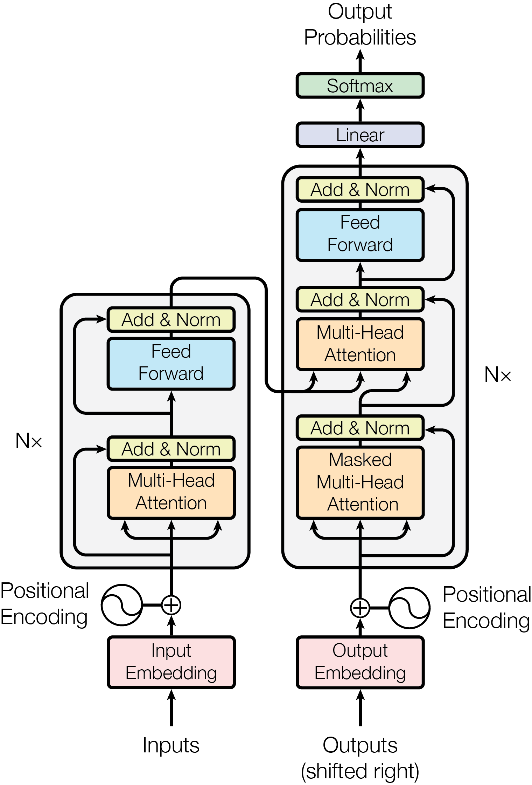
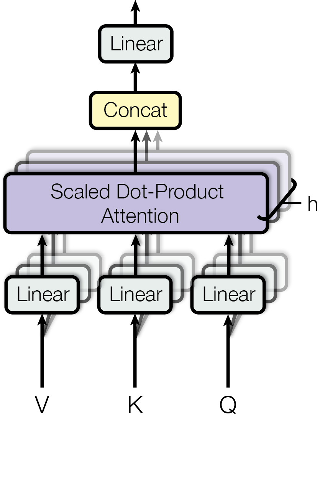

<!-- class: title -->

論文紹介 2026/05/30

NC

  

    
京都大学

    
宮前明生

  

---
<!-- class: agenda show-page -->

  
アジェンダ

  

    
研究背景と課題

    
Neural Collapseの発見

    
Neural Collapseの各現象

    
実験設定と結果

    
性能向上への寄与

    
まとめ

  

---

<!-- class: content-gray show-page -->

## 研究背景：深層学習の「ブラックボックス」性
深層学習モデルは高性能だが、その内部動作は不明瞭なままです。

*   **現在の訓練パラダイム**: 画像分類などで人間を超える性能を達成。
*   **訓練の終端フェーズ (TPT)**: 訓練エラーがゼロになった後も損失をゼロに近づけるまで訓練を継続するフェーズ。
    *   従来は、過剰パラメータ化されたモデルの挙動は任意的・カオス的と予想されていた。
*   **既存研究の限界**: これまでの研究では、データ適応的な特徴エンジニアリングの文脈での洞察は限定的でした。

---

<!-- class: content-gray show-page -->

## 解決したい課題
TPT中の深層学習モデルの内部構造と性能向上との関連性を解明します。

*   **モデル内部構造の解明**: TPT中に最終層の活性化と分類器が、予測不可能な振る舞いではなく、単純な数学的構造へ収束するのかを明らかにします。
*   **構造特定**: その収束する構造が具体的にどのようなものかを特定します。
*   **性能向上との関連性**: この構造的収束が、モデルの汎化性能や敵対的ロバスト性（頑健性）にどのように貢献するかを実証します。
*   **ブラックボックス性の低減**: これらの知見を通じて、深層学習の「ブラックボックス」性の低減を目指します。

---

<!-- class: content-gray show-page -->

## Neural Collapseの発見
TPT中に深層学習モデルが示す、シンプルで対称的な構造的収束を発見しました。

*   **Neural Collapse (NC)**: 訓練の終端フェーズ (TPT) 中に発生する、広範な誘導バイアスです。
    *   最終層の活性化と分類器が、驚くほど単純な幾何学へと収束します。
    *   これは、これまでの任意的・カオス的という予想とは対照的な結果です。
*   **4つの相互関連する現象**:
    *   NC1: Variability Collapse
    *   NC2: Convergence to Simplex ETF
    *   NC3: Convergence to Self-Duality
    *   NC4: Simplification to Nearest Class-Center (NCC)
*   この構造は、汎化性能、ロバスト性、解釈可能性の向上に寄与します。

---

<!-- class: content-gray show-page -->

## Neural Collapseの現象1: Variability Collapse (NC1)
訓練が進むにつれて、クラス内の活性化のばらつきがゼロに収束します。

*   **現象**: 最終層の訓練活性化におけるクラス内変動が無視できるレベルにまで減少します。
    *   個々の活性化は、それぞれのクラス平均に収束します。
*   **数学的表現**:
    $$
    \Sigma_W \rightarrow 0
    $$
    *   $\Sigma_W$ は訓練活性化のクラス内共分散を示します。
*   **意味**: 各クラスのデータ点が、特徴空間内でそれぞれのクラスの中心点に凝集していくことを意味します。

---

<!-- class: content-gray show-page -->

## Neural Collapseの現象2: Convergence to Simplex ETF (NC2)
クラス平均ベクトルがSimplex ETFの頂点に収束します。

*   **Simplex ETF (Equiangular Tight Frame)**:
    *   等しい長さと等しい角度を持つベクトル集合。
    *   任意の2つのベクトル間の距離が最大化される配置です。
    *   
    class-means, or in other words to the Simplex ETF.
*   **現象**: クラス平均ベクトル（グローバル平均で中心化後）は、Simplex ETFの頂点に収束します。
    *   クラス平均間のノルムと角度のばらつきがゼロに近づきます。
*   **数学的表現**:
    $$
    \frac{|||\mu_c - \mu_G||_2^2 - |||\mu_{c'} - \mu_G||_2^2|}{|||\mu_c - \mu_G||_2^2|||\mu_{c'} - \mu_G||_2^2|} \rightarrow 0 \quad \forall c, c' \\
    \left|\left(\frac{\mu_c - \mu_G}{||\mu_c - \mu_G||_2}, \frac{\mu_{c'} - \mu_G}{||\mu_{c'} - \mu_G||_2}\right) - \frac{-1}{C-1}\right| \rightarrow 0 \quad \forall c, c' \neq c
    $$
    *   $\mu_c$ はクラス平均、$\mu_G$ はグローバル平均。
*   **意味**: 特徴空間内で、各クラス平均が互いに「等距離」に配置されることを示唆します。

---

<!-- class: content-gray show-page -->

## Neural Collapseの現象3: Convergence to Self-Duality (NC3)
最終層の分類器がクラス平均と自己双対的に一致します。

*   **自己双対性**: 数学的に異なるオブジェクトであるクラス平均と線形分類器が、スケーリングを除いて互いに収束すること。
*   **現象**: 最終層の線形分類器が、クラス平均（Simplex ETF）に収束します。
    *   これにより、ネットワーク分類器の決定領域に完全な対称性が生まれます。
*   **数学的表現**:
    $$
    \left|\frac{W^T}{\|W\|_F} - \frac{M}{\|M\|_F}\right|_F \rightarrow 0
    $$
    *   $W$ は線形分類器の重み、$M$ はクラス平均の行列。
*   **意味**: 分類器の各決定領域が他の領域と等尺的になり、クラス平均がそれぞれの領域の中心に位置するため、クラス間の混同が均一になります。

---

<!-- class: content-gray show-page -->

## Neural Collapseの現象4: Simplification to Nearest Class-Center (NCC)
分類器の決定ルールが最も近いクラス中心を選択する単純なルールに収束します。

*   **現象**: 特定の深層学習活性化に対し、ネットワーク分類器は標準ユークリッド距離で最も近い訓練クラス平均を持つクラスを選択するようになります。
*   **数学的表現**:
    $$
    \arg \max_{c'} (\mathbf{w}_{c'}^T \mathbf{h} + b_{c'}) \rightarrow \arg \min_{c'} ||\mathbf{h} - \mathbf{\mu}_{c'}||_2^2
    $$
    *   $\mathbf{w}_{c'}$ と $b_{c'}$ はクラス $c'$ の分類器の重みとバイアス、$\mathbf{h}$ は最終層の活性化、$\mathbf{\mu}_{c'}$ はクラス $c'$ の平均。
*   **意味**: 複雑な線形分類器の決定プロセスが、幾何学的に最も近いクラス中心を選ぶという非常にシンプルで解釈可能なルールに移行します。

---

<!-- class: content-gray show-page -->

## 実験設定
主要な分類データセットと代表的な深層学習アーキテクチャでNeural Collapseを検証しました。

  

    ### データセット
    *   **7つの代表的データセット**:
        *   MNIST, FashionMNIST, SVHN
        *   CIFAR10, CIFAR100
        *   STL10, ImageNet
    *   ImageNetはクラスあたり600例、その他は5000例（またはそれ以上）でバランス調整。
    *   前処理: ピクセルごとの平均減算、標準偏差除算。
  

  

    ### ネットワークアーキテクチャ
    *   **3つのプロトタイプ**:
        *   VGG (11, 13, 19)
        *   ResNet (18, 50, 152)
        *   DenseNet (40, 201, 250)
    *   各データセットの難易度に合わせて深さを調整。
    *   VGGのDropout層はBatch Normalizationに置き換え。
  

    ### 最適化
    *   **損失関数**: Cross-entropy loss を使用。
    *   **オプティマイザ**: SGD (momentum 0.9, weight decay $1 \times 10^{-4}$ または $5 \times 10^{-4}$)。
    *   **学習率**: ImageNetは10種類、その他は25種類を対数スケールで探索。
    *   **訓練**: ImageNetは300エポック、その他は350エポック。

---

<!-- class: content-gray show-page -->

## 実験結果: Neural Collapse現象の可視化
クラス平均や分類器が訓練の終端フェーズで対称的な構造へ収束することを確認しました。

*   **NC1 (Variability Collapse)**:
    *   クラス内共分散がゼロに収束。
    *   
    Fig. 5. Classifier converges to train class-means: distance between the classifiers and the centered class-means, both rescaled to unit-norm.
*   **NC2 (Simplex ETF)**:
    *   クラス平均のノルムが等しくなり（図2）、クラス平均間の角度が等しくなり、最大角平衡性を示す（図3, 図4）。
*   **NC3 (Self-Duality)**:
    *   分類器がクラス平均と比例的に一致（自己双対性）。
    *   
    Fig. 3. Classifiers and train class-means approach equiangularity.
*   **NC4 (Simplification to NCC)**:
    *   分類器の決定がNearest Class-Centerルールに近づく。
    *   
    PNAS article reference.
*   これらの現象は、TPTが始まってから（訓練エラーがほぼゼロになってから）顕著に進行することを確認。

---

<!-- class: content-gray show-page -->

## 実験結果: 性能向上への寄与
Neural Collapseは、汎化性能と敵対的ロバスト性の向上に貢献します。

*   **汎化性能の向上**:
    *   TPT中もテスト精度が着実に向上します (表1)。
    *   ゼロエラー達成後も訓練を継続する意義を示唆します。
*   **敵対的ロババスト性の向上**:
    *   TPT中も敵対的摂動に対する頑健性が向上します (図8)。
    *   
    Fig. 8. Training beyond zero-error improves adversarial robustness.
    *   多くのロバスト性向上はTPT中に発生します。

---

<!-- class: content-gray show-page -->

## 考察: 既存研究との関連性
Neural Collapseは、既存の深層学習に関する知見に新たな視点を提供します。

*   **理論的な特徴エンジニアリング**:
    *   以前の研究 (scattering transform) はクラス内変動の抑制を目指していました。
    *   NC1は、現代の深層学習訓練がこの目標を経験的に達成していることを示します。
*   **スペクトルHessianの構造**:
    *   深層学習の損失関数のHessianが示す特異なスペクトル構造（クラス数に等しい外れ値）は、NC1とNC2によって説明できます。
    *   活性化のクラス平均への収束とSimplex ETFへの収束が、これらの外れ値の発生を促します。
*   **ノイズに対する安定性**:
    *   Simplex ETFの特性である「等しい非ゼロ特異値」は、ノイズ増幅に対する抵抗性を提供します。
    *   これにより、敵対的ロバスト性が自然に向上することが示唆されます。

---

<!-- class: content-gray show-page -->

## まとめ
本研究は、深層学習の訓練終端フェーズにおけるNeural Collapse現象を解明しました。

*   **Neural Collapseの発見**: 訓練終端フェーズ (TPT) 中に、最終層の活性化と分類器が、Simplex ETFのような単純で対称的な幾何学構造に収束することを発見しました (NC1-NC4)。
*   **普遍的な現象**: この現象は、様々なデータセットとアーキテクチャにわたって普遍的に発生します。
*   **重要な利点**: Neural Collapseは、ネットワークの汎化性能と敵対的ロバスト性の向上に貢献し、深層学習の「ブラックボックス」性の低減と解釈可能性の向上をもたらします。